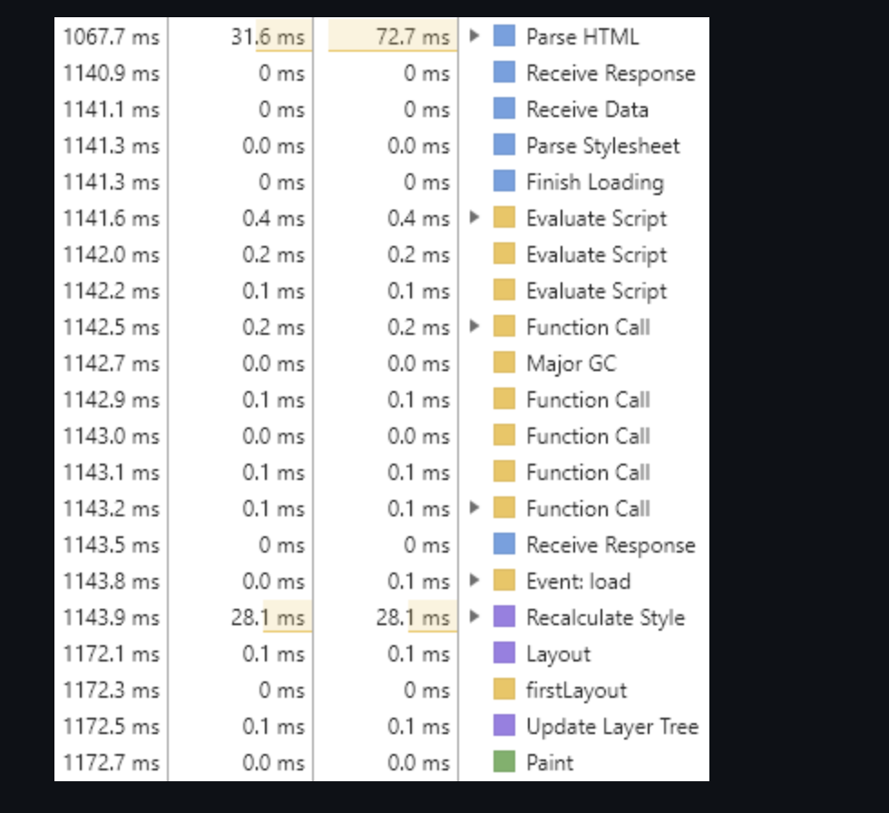

### 브라우저의 렌더링 원리

브라우저가 화면에 나타나는 요소를 렌더링 할 때, 웹킷(Webkit)이나 게코(Gecko) 등과 같은 렌더링 엔진을 사용한다.  
렌더링 엔진이 HTML, CSS , JS로 렌더링 할 때 CRP(critical rendering path)라는 프로세스를 사용하며 다음 단계로 이루어진다.  

1. HTML 파싱 후, DOM(DOCUMENT OBJECT MODEL) 트리 구축  
2. CSS 파싱 후, CSSOM(CSS OBJECT MODEL) 트리 구축  
3. Javascript 실행 (html 중간에 스크립트가 있으면 html파싱이 중단됨)  
4. DOM과 CSSOM을 조합하여 렌더트리(RENDER TREE) 구축 (display: none 속성과 같이 화면에서도 보이지 않고 공간을 차지하지 않는 것은 렌더트리로 구축되지 않는다.)  
5. 뷰포트 기반으로 렌더트리의 각 노드가 가지는 정확한 위치와 크기 계산 (Layout/ Reflow 단계)  
6. 계산한 위치/크기를 기반으로 화면에 그림(Paint 단계)  

  

위 로그를 보면 알 수 있는 것처럼 위에서 언급한 CRP가 진행된다.  

1. Parse HTML을 통해 HTML 파싱 후, DOM 트리 구축  
2. Parse Stylesheet를 통해 CSS 파싱 후, CSSOM 트리 구축  
3. Evaluate Script를 통해 Javascript 실행  
4. 렌더트리 구축  
5. Layout을 통해 뷰포트 기준으로 렌더트리 노드들의 각 크기/위치 계산  
6. Paint를 통해 Layout에서 계산한 값들로 각 요소를 화면에 그림  
