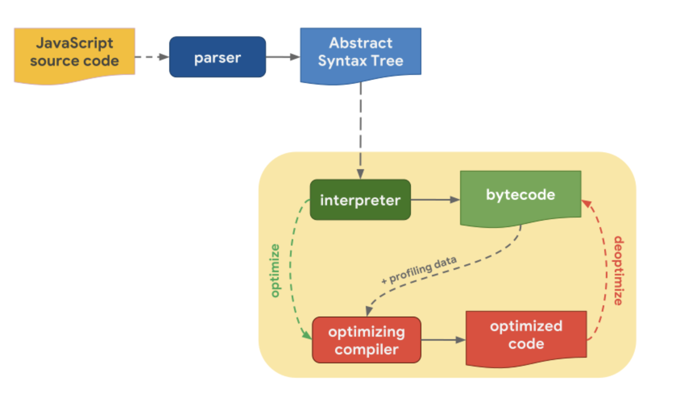

### 자바스크립트 엔진이 코드를 실행하는 과정

자바스크립트를 실행하기 위해선 자바스크립트 엔진이 필요하고 웹 브라우저는 자바스크립트 엔진을 내장하고 있다.  
브라우저마다 엔진의 종류가 다르지만 코드를 실행하는 방식은 비슷하기 때문에 보통 어떻게 실행하는지 알아두는 것이 좋다.  
(V8, SpiderMonkey, Javascript core 등의 구현이 각각 다르다)  

  

1. 자바스크립트 소스 코드를 만나면 파싱하여 AST(abstract syntax tree)로 변환한다.
2. 인터프리터는 AST를 기반으로 바이트코드(bytecode)를 생성한다.
3. 인터프리터가 바이트 코드를 실행 할 때, 자주 사용되는 함수 및 타입 정보 등이 있는 프로파일링 데이터(profiling data)와 같이 최적화 컴파일러에게 보낸다.
4. 최적화 컴파일러는 프로파일링 데이터를 기반으로 최적화된 코드( optimized code)를 생성 한다.
5. 하지만, 프로파일링 데이터 중에 잘못된 부분이 있다면 최적화 해제(deoptimized)를 하고 다시 바이트 코드를 실행해 이전 동작을 반복한다.
